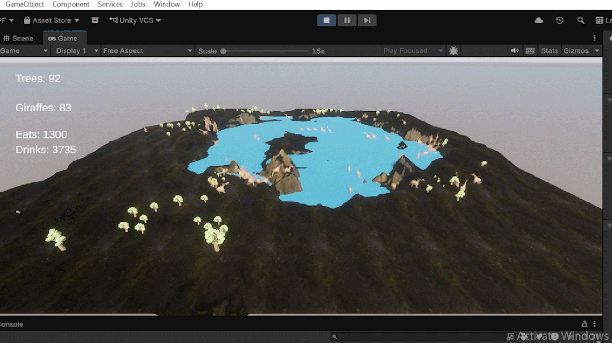

  
  
  <h1>🌍 Giraffe Ecosystem Simulator</h1>
  
<i>An open-source, neural-network-driven digital ecosystem built with Unity 6 & ML-Agents.</i>

  

    Read the full technical breakdown on <a href="https://indiedevgame.com" target="_blank">indiedevgame.com</a>  
    Watch the devlogs and AI tutorials at the <a href="https://www.youtube.com/@ascendanceinstitute" target="_blank">Ascendance Institute YouTube Channel</a>
  

---

## 🧠 About the Project

This project explores the intersection of artificial intelligence, digital nature, and game development. Instead of programming rigid "if/then" behaviors, this simulator uses **Unity ML-Agents** to drop a herd of AI-driven giraffes into a digital savannah and forces them to figure out how to survive using reinforcement learning. 

The ultimate goal of this open-source project is to build hyper-intelligent digital ecosystems to better understand and serve real-world nature.

## ✨ Core Simulation Features

* **Neural Network Brains:** Giraffes balance internal biological timers (Thirst and Hunger) and receive rewards for surviving to old age and successfully reproducing.
* **Asexual Reproduction & Lifecycles:** If a giraffe successfully grazes enough food, it enters a gestation period before spawning a new generation. Every agent is assigned a random natural lifespan to prevent immortal overpopulation.
* **Dynamic Flora:** Oak trees act as interactive resources with their own lifecycles. Trees start as tiny seeds dropped by giraffes, take time to grow, and have a maximum bite-capacity before being destroyed.
* **Environmental Hazards:** The AI must learn to navigate the terrain. Shallow water edges are safe for drinking, but wading into the deep water triggers a drowning penalty, forcing the neural network to respect map hazards.
* **Automated Data Logging:** A global `EcosystemCounter` tracks peak populations and triggers automatic JSON data exports during extinction events, allowing for deep analysis of the AI's evolutionary progress.

## 🚀 Getting Started

### Prerequisites
* **Unity 6** (or newer)
* **Python